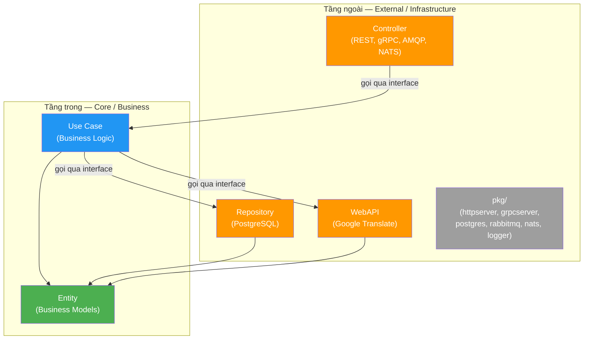
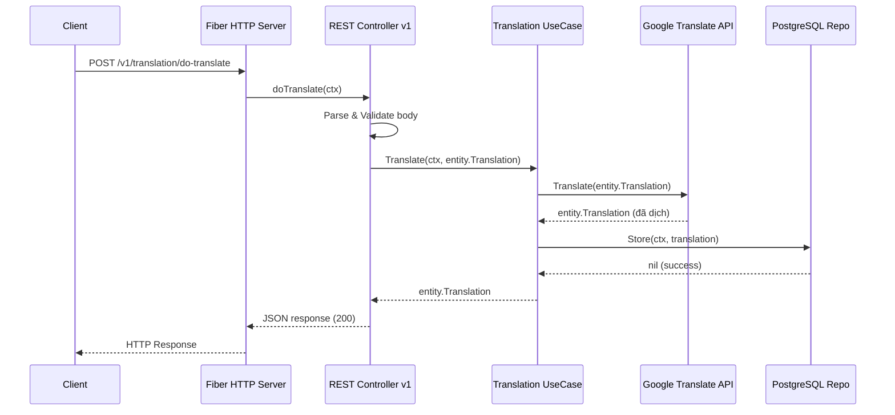
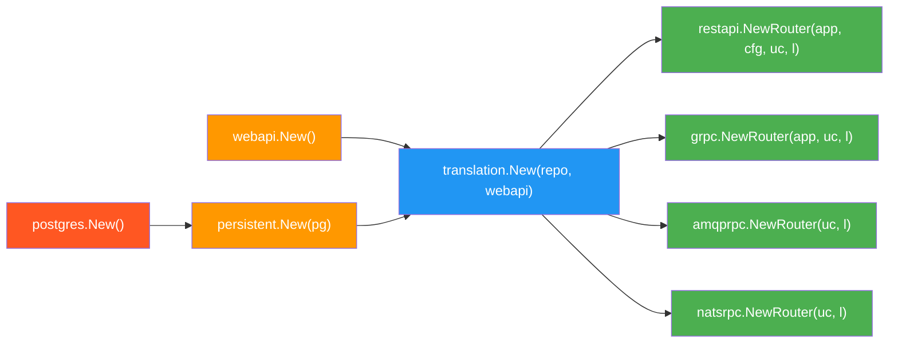
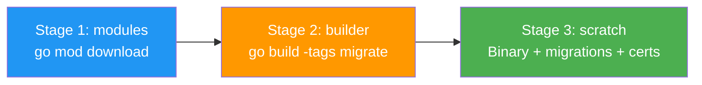
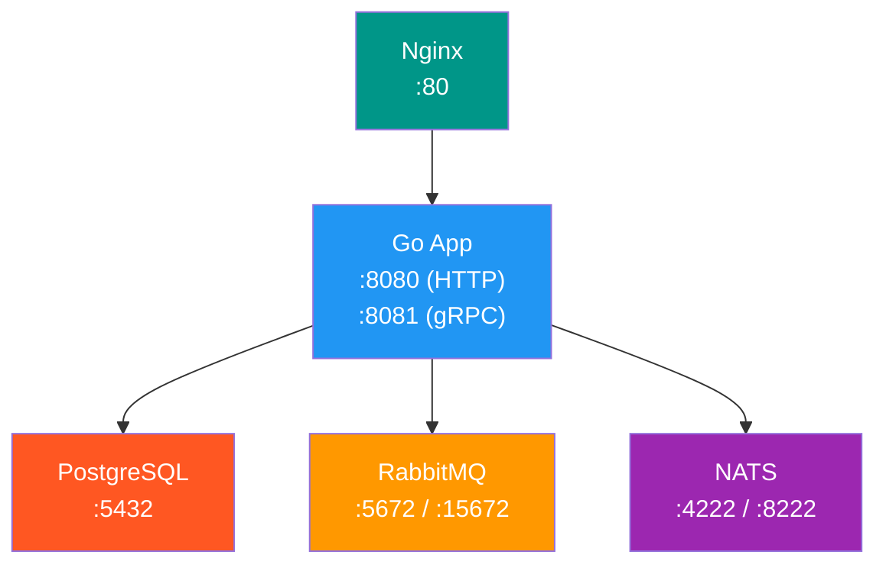
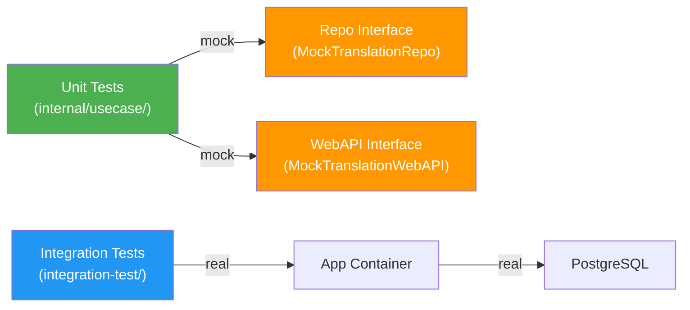

# 🏗️ Kiến trúc hệ thống — Go Clean Template

> Tài liệu mô tả chi tiết kiến trúc dự án **Go Clean Template** — một microservice mẫu áp dụng nguyên tắc **Clean Architecture** (Robert C. Martin) cho Golang.

---

## Mục lục

1. [Tổng quan hệ thống](#1-tổng-quan-hệ-thống)
2. [Cấu trúc thư mục](#2-cấu-trúc-thư-mục)
3. [Các tầng kiến trúc (Clean Architecture)](#3-các-tầng-kiến-trúc-clean-architecture)
4. [Luồng dữ liệu & Dependency Injection](#4-luồng-dữ-liệu--dependency-injection)
5. [Các loại Server](#5-các-loại-server)
6. [Infrastructure Packages (`pkg/`)](#6-infrastructure-packages-pkg)
7. [Configuration & Environment](#7-configuration--environment)
8. [Database & Migrations](#8-database--migrations)
9. [Docker & Deployment](#9-docker--deployment)
10. [Testing](#10-testing)
11. [Hướng dẫn thêm module mới](#11-hướng-dẫn-thêm-module-mới)

---

## 1. Tổng quan hệ thống

### Mục tiêu

- Tổ chức project Go theo hướng **Clean Architecture** để tránh spaghetti code
- Business logic **độc lập**, sạch, dễ mở rộng và kiểm thử
- Giữ kiểm soát khi microservice ngày càng lớn

### Nguyên tắc cốt lõi

| Nguyên tắc | Mô tả |
|---|---|
| **Dependency Inversion** | Hướng phụ thuộc đi từ tầng ngoài → tầng trong. Business logic không biết về Postgres, Fiber, hay RabbitMQ |
| **Interface Segregation** | Giao tiếp giữa các tầng qua interface, cho phép thay đổi implementation mà không ảnh hưởng logic |
| **Separation of Concerns** | Mỗi tầng có trách nhiệm riêng biệt, không xâm phạm lẫn nhau |

### Tech Stack

| Thành phần | Công nghệ |
|---|---|
| Language | Go 1.25 |
| HTTP Framework | [Fiber](https://github.com/gofiber/fiber) v2 |
| gRPC Framework | [google.golang.org/grpc](https://grpc.io/) |
| Message Broker (AMQP) | [RabbitMQ](https://www.rabbitmq.com/) via `amqp091-go` |
| Message Broker (MQ) | [NATS](https://nats.io/) via `nats.go` |
| Database | PostgreSQL 18 via `pgx/v5` (connection pool) |
| Query Builder | [Squirrel](https://github.com/Masterminds/squirrel) |
| Migrations | [golang-migrate](https://github.com/golang-migrate/migrate) |
| Logger | [Zerolog](https://github.com/rs/zerolog) |
| JSON | [goccy/go-json](https://github.com/goccy/go-json) (fast serialization) |
| Validation | [go-playground/validator](https://github.com/go-playground/validator) |
| Metrics | [Prometheus](https://github.com/ansrivas/fiberprometheus) |
| API Docs | [Swag](https://github.com/swaggo/swag) (Swagger auto-gen) |
| Testing | [Testify](https://github.com/stretchr/testify) + [GoMock](https://go.uber.org/mock) |
| Reverse Proxy | Nginx |
| Containerization | Docker + Docker Compose |

---

## 2. Cấu trúc thư mục

```
go-clean-template/
├── cmd/
│   └── app/
│       └── main.go                  # Entry point — khởi tạo config, gọi app.Run()
├── config/
│   └── config.go                    # Struct config, đọc từ environment variables
├── docs/
│   ├── img/                         # Hình ảnh kiến trúc
│   ├── proto/v1/                    # Protobuf definitions cho gRPC
│   ├── swagger.json / swagger.yaml  # Swagger auto-generated
│   ├── docs.go                      # Swagger embed code
│   └── ARCHITECTURE.md              # ← Tài liệu này
├── internal/
│   ├── app/
│   │   ├── app.go                   # Bootstrap: DI, khởi tạo servers, graceful shutdown
│   │   └── migrate.go               # Auto-migration (build tag: migrate)
│   ├── controller/                  # Tầng Controller (entry points)
│   │   ├── restapi/                 # REST API via Fiber
│   │   │   ├── router.go            # Main router: middleware, swagger, healthz, metrics
│   │   │   ├── middleware/           # Logger, Recovery middleware
│   │   │   └── v1/                  # API v1 handlers
│   │   │       ├── controller.go    # Struct V1 chứa usecase + logger + validator
│   │   │       ├── router.go        # Route definitions (/translation/*)
│   │   │       ├── translation.go   # Handler: history, doTranslate
│   │   │       ├── error.go         # Error response helper
│   │   │       ├── request/         # Request DTOs
│   │   │       └── response/        # Response DTOs
│   │   ├── grpc/                    # gRPC server
│   │   │   ├── router.go            # gRPC router + reflection
│   │   │   └── v1/                  # gRPC v1 handlers
│   │   ├── amqp_rpc/                # RabbitMQ RPC server
│   │   │   ├── router.go            # AMQP RPC router
│   │   │   └── v1/                  # AMQP RPC v1 handlers
│   │   └── nats_rpc/                # NATS RPC server
│   │       ├── router.go            # NATS RPC router
│   │       └── v1/                  # NATS RPC v1 handlers
│   ├── entity/                      # Tầng Entity (business models)
│   │   ├── translation.go           # Translation struct
│   │   └── translation.history.go   # TranslationHistory struct
│   ├── usecase/                     # Tầng Use Case (business logic)
│   │   ├── contracts.go             # Interface: Translation (Translate, History)
│   │   └── translation/
│   │       └── translation.go       # Implementation: UseCase struct
│   └── repo/                        # Tầng Repository (data access interfaces)
│       ├── contracts.go             # Interfaces: TranslationRepo, TranslationWebAPI
│       ├── persistent/
│       │   └── translation_postgres.go  # PostgreSQL implementation
│       └── webapi/
│           └── translation_google.go    # Google Translate API implementation
├── pkg/                             # Shared infrastructure packages
│   ├── httpserver/                   # Fiber HTTP server wrapper
│   ├── grpcserver/                   # gRPC server wrapper
│   ├── postgres/                     # PostgreSQL connection pool wrapper
│   ├── logger/                       # Zerolog logger wrapper
│   ├── rabbitmq/rmq_rpc/            # RabbitMQ RPC client/server
│   └── nats/nats_rpc/               # NATS RPC client/server
├── migrations/                      # SQL migration files
├── integration-test/                # Integration tests (chạy trong Docker)
├── nginx/
│   └── nginx.conf                   # Reverse proxy configuration
├── .env.example                     # Mẫu environment variables
├── docker-compose.yml               # 5 services: db, rabbitmq, nats, app, nginx
├── Dockerfile                       # Multi-stage Docker build
└── Makefile                         # Build, test, lint commands
```

---

## 3. Các tầng kiến trúc (Clean Architecture)

### Tổng quan các tầng



> **Quy tắc vàng:** Hướng phụ thuộc **luôn đi từ ngoài vào trong**. Tầng trong (Entity, UseCase) **không import** bất kỳ package nào từ tầng ngoài.

### 3.1. Entity — Tầng thực thể

**Vị trí:** `internal/entity/`

Entity là các struct đại diện cho đối tượng nghiệp vụ. Chúng **không phụ thuộc** vào bất kỳ tầng nào khác, có thể được sử dụng ở mọi nơi.

```go
// internal/entity/translation.go
type Translation struct {
    Source      string `json:"source"       example:"auto"`
    Destination string `json:"destination"  example:"en"`
    Original    string `json:"original"     example:"текст для перевода"`
    Translation string `json:"translation"  example:"text for translation"`
}

// internal/entity/translation.history.go
type TranslationHistory struct {
    History []Translation `json:"history"`
}
```

**Đặc điểm:**
- Chỉ dùng Go standard library
- Có thể chứa validation methods
- Tương đương với **Model** trong MVC

### 3.2. Use Case — Tầng logic nghiệp vụ

**Vị trí:** `internal/usecase/`

Use Case chứa toàn bộ business logic. Nó định nghĩa **interface** cho những gì cần làm và **implementation** cho cách thực hiện.

**Interface (contracts):**

```go
// internal/usecase/contracts.go
type Translation interface {
    Translate(context.Context, entity.Translation) (entity.Translation, error)
    History(context.Context) (entity.TranslationHistory, error)
}
```

**Implementation:**

```go
// internal/usecase/translation/translation.go
type UseCase struct {
    repo   repo.TranslationRepo    // Interface — không biết là PostgreSQL
    webAPI repo.TranslationWebAPI  // Interface — không biết là Google Translate
}

func New(r repo.TranslationRepo, w repo.TranslationWebAPI) *UseCase {
    return &UseCase{repo: r, webAPI: w}
}

func (uc *UseCase) Translate(ctx context.Context, t entity.Translation) (entity.Translation, error) {
    translation, err := uc.webAPI.Translate(t)    // Gọi external API qua interface
    if err != nil { return entity.Translation{}, ... }

    err = uc.repo.Store(ctx, translation)          // Lưu vào DB qua interface
    if err != nil { return entity.Translation{}, ... }

    return translation, nil
}
```

**Đặc điểm:**
- Chỉ import `entity` và `repo` (interfaces)
- **Không** import `postgres`, `fiber`, hay bất kỳ framework nào
- Dễ dàng unit test bằng mock

### 3.3. Repository — Tầng truy cập dữ liệu

**Vị trí:** `internal/repo/`

Repository định nghĩa các **interface** cho thao tác dữ liệu. Implementation cụ thể nằm trong các sub-packages.

**Interfaces:**

```go
// internal/repo/contracts.go
type TranslationRepo interface {
    Store(context.Context, entity.Translation) error
    GetHistory(context.Context) ([]entity.Translation, error)
}

type TranslationWebAPI interface {
    Translate(entity.Translation) (entity.Translation, error)
}
```

**Implementation — PostgreSQL:**

```go
// internal/repo/persistent/translation_postgres.go
type TranslationRepo struct {
    *postgres.Postgres   // Embed: Pool + Builder (squirrel)
}

func (r *TranslationRepo) Store(ctx context.Context, t entity.Translation) error {
    sql, args, _ := r.Builder.
        Insert("history").
        Columns("source, destination, original, translation").
        Values(t.Source, t.Destination, t.Original, t.Translation).
        ToSql()
    _, err := r.Pool.Exec(ctx, sql, args...)
    return err
}
```

**Implementation — Google Translate API:**

```go
// internal/repo/webapi/translation_google.go
type TranslationWebAPI struct {
    conf translator.Config
}

func (t *TranslationWebAPI) Translate(translation entity.Translation) (entity.Translation, error) {
    trans := translator.New(t.conf)
    result, _ := trans.Translate(translation.Original, translation.Source, translation.Destination)
    translation.Translation = result.Text
    return translation, nil
}
```

### 3.4. Controller — Tầng điểm vào (Entry Points)

**Vị trí:** `internal/controller/`

Controller nhận request từ bên ngoài, chuyển đổi sang Entity, gọi UseCase, và trả response. Dự án này có **4 loại controller** tương ứng 4 loại server.

| Controller | Thư mục | Framework | Protocol |
|---|---|---|---|
| REST API | `controller/restapi/` | Fiber v2 | HTTP |
| gRPC | `controller/grpc/` | google.golang.org/grpc | HTTP/2 + Protobuf |
| AMQP RPC | `controller/amqp_rpc/` | RabbitMQ (amqp091-go) | AMQP |
| NATS RPC | `controller/nats_rpc/` | NATS (nats.go) | NATS protocol |

---

## 4. Luồng dữ liệu & Dependency Injection

### 4.1. Luồng request tiêu biểu (REST API)



### 4.2. Dependency Injection trong `app.go`

Toàn bộ DI diễn ra tại `internal/app/app.go` — **composition root** của ứng dụng:

```go
func Run(cfg *config.Config) {
    l := logger.New(cfg.Log.Level)

    // 1. Infrastructure: Database
    pg, _ := postgres.New(cfg.PG.URL, postgres.MaxPoolSize(cfg.PG.PoolMax))
    defer pg.Close()

    // 2. Use Case: inject repo + webapi interfaces
    translationUseCase := translation.New(
        persistent.New(pg),   // TranslationRepo interface ← PostgreSQL impl
        webapi.New(),         // TranslationWebAPI interface ← Google impl
    )

    // 3. Controllers: inject usecase interface
    // RabbitMQ RPC
    rmqRouter := amqprpc.NewRouter(translationUseCase, l)
    rmqServer, _ := rmqRPCServer.New(cfg.RMQ.URL, cfg.RMQ.ServerExchange, rmqRouter, l)

    // NATS RPC
    natsRouter := natsrpc.NewRouter(translationUseCase, l)
    natsServer, _ := natsRPCServer.New(cfg.NATS.URL, cfg.NATS.ServerExchange, natsRouter, l)

    // gRPC
    grpcServer := grpcserver.New(l, grpcserver.Port(cfg.GRPC.Port))
    grpc.NewRouter(grpcServer.App, translationUseCase, l)

    // HTTP (REST)
    httpServer := httpserver.New(l, httpserver.Port(cfg.HTTP.Port))
    restapi.NewRouter(httpServer.App, cfg, translationUseCase, l)

    // 4. Start all servers
    rmqServer.Start()
    natsServer.Start()
    grpcServer.Start()
    httpServer.Start()

    // 5. Graceful Shutdown — chờ signal hoặc error
    // ...
}
```

**Chuỗi DI:**



### 4.3. Graceful Shutdown

Ứng dụng chờ **signal** (SIGINT/SIGTERM) hoặc **error** từ bất kỳ server nào, sau đó shutdown tất cả theo thứ tự:

```
HTTP Server → gRPC Server → RabbitMQ Server → NATS Server
```

Mỗi server đều có pattern `Start()` / `Notify()` / `Shutdown()`:

```go
select {
case s := <-interrupt:       // OS signal
case err = <-httpServer.Notify():   // HTTP error
case err = <-grpcServer.Notify():   // gRPC error
case err = <-rmqServer.Notify():    // RMQ error
case err = <-natsServer.Notify():   // NATS error
}
// → Shutdown tất cả servers
```

---

## 5. Các loại Server

### 5.1. REST API (Fiber)

**File:** `internal/controller/restapi/`

| Thuộc tính | Giá trị |
|---|---|
| Framework | Fiber v2 |
| Port mặc định | `:8080` |
| JSON Engine | `goccy/go-json` (nhanh hơn `encoding/json`) |
| Validation | `go-playground/validator` |
| API Docs | Swagger (auto-gen bởi `swag`) |
| Metrics | Prometheus (`/metrics`) |
| Health Check | `/healthz` |

**Router structure:**

```
restapi/router.go          → Middleware (Logger, Recovery), Prometheus, Swagger, Healthz
  └── v1/router.go         → /v1/translation/*
        ├── GET  /history      → history handler
        └── POST /do-translate → doTranslate handler
```

**Versioning:** Thêm folder `v2/` và group mới trong `router.go`:

```go
apiV2Group := app.Group("/v2")
{
    v2.NewTranslationRoutes(apiV2Group, t, l)
}
```

### 5.2. gRPC

**File:** `internal/controller/grpc/`

| Thuộc tính | Giá trị |
|---|---|
| Framework | google.golang.org/grpc |
| Port mặc định | `:8081` |
| Proto files | `docs/proto/v1/*.proto` |
| Reflection | Enabled (hỗ trợ tools như `grpcurl`) |

**Versioning:** Tạo folder `v2/` và thêm proto files tại `docs/proto/v2/`.

**Generate code từ proto:**

```sh
make proto-v1
# hoặc:
protoc --go_out=. --go_opt=paths=source_relative \
       --go-grpc_out=. --go-grpc_opt=paths=source_relative \
       docs/proto/v1/*.proto
```

### 5.3. AMQP RPC (RabbitMQ)

**File:** `internal/controller/amqp_rpc/`

| Thuộc tính | Giá trị |
|---|---|
| Transport | RabbitMQ via `amqp091-go` |
| Pattern | Request-Reply (RPC) |
| Exchange type | Fanout → 1 exclusive queue |
| Auto-reconnect | Có |

**Routing** được implement dưới dạng `map[string]server.CallHandler`:

```go
func NewRouter(t usecase.Translation, l logger.Interface) map[string]server.CallHandler {
    routes := make(map[string]server.CallHandler)
    {
        v1.NewTranslationRoutes(routes, t, l)
    }
    return routes
}
```

### 5.4. NATS RPC

**File:** `internal/controller/nats_rpc/`

| Thuộc tính | Giá trị |
|---|---|
| Transport | NATS via `nats.go` |
| Pattern | Request-Reply (RPC) |
| Auto-reconnect | Có |

Cấu trúc và cách routing tương tự AMQP RPC — cũng dùng `map[string]server.CallHandler`.

---

## 6. Infrastructure Packages (`pkg/`)

Các package trong `pkg/` là **wrapper** tái sử dụng, sử dụng **Options Pattern** để cấu hình linh hoạt.

### 6.1. `pkg/httpserver` — Fiber HTTP Server

```go
type Server struct {
    App    *fiber.App
    // Start(), Notify(), Shutdown()
}

// Khởi tạo với Options Pattern:
httpServer := httpserver.New(l,
    httpserver.Port(cfg.HTTP.Port),
    httpserver.Prefork(cfg.HTTP.UsePreforkMode),
)
```

**Features:** Prefork mode, configurable timeouts, graceful shutdown với `errgroup`.

### 6.2. `pkg/grpcserver` — gRPC Server

```go
type Server struct {
    App    *pbgrpc.Server
    // Start(), Notify(), Shutdown()
}

grpcServer := grpcserver.New(l, grpcserver.Port(cfg.GRPC.Port))
```

**Features:** TCP listener, `GracefulStop()`, error notification channel.

### 6.3. `pkg/postgres` — PostgreSQL Connection Pool

```go
type Postgres struct {
    Builder squirrel.StatementBuilderType  // SQL query builder ($1, $2, ... placeholders)
    Pool    *pgxpool.Pool                  // Connection pool
}

pg, err := postgres.New(url,
    postgres.MaxPoolSize(cfg.PG.PoolMax),
    postgres.ConnAttempts(10),
    postgres.ConnTimeout(time.Second),
)
```

**Features:**
- Connection pool via `pgx/v5`
- Retry logic (mặc định 10 lần, mỗi lần cách 1 giây)
- Squirrel query builder tích hợp sẵn (dùng `$` placeholder cho PostgreSQL)

### 6.4. `pkg/logger` — Structured Logger

```go
type Interface interface {
    Debug(message interface{}, args ...interface{})
    Info(message string, args ...interface{})
    Warn(message string, args ...interface{})
    Error(message interface{}, args ...interface{})
    Fatal(message interface{}, args ...interface{})
}

l := logger.New("debug")  // debug | info | warn | error
```

**Features:** Zerolog-based, structured JSON output, caller info, interface-based (dễ mock trong tests).

### 6.5. `pkg/rabbitmq` — RabbitMQ RPC

```
pkg/rabbitmq/rmq_rpc/
├── connection.go     # Connection management + auto-reconnect
├── errors.go         # Error types
├── client/           # RPC Client
│   ├── client.go
│   └── options.go
└── server/           # RPC Server
    ├── server.go
    └── options.go
```

**Features:** Fanout exchange, exclusive queue, auto-reconnect, Options Pattern.

### 6.6. `pkg/nats` — NATS RPC

```
pkg/nats/nats_rpc/
├── errors.go         # Error types
├── client/           # RPC Client
│   ├── client.go
│   └── options.go
└── server/           # RPC Server
    ├── server.go
    └── options.go
```

---

## 7. Configuration & Environment

### Cơ chế

Config được đọc hoàn toàn từ **environment variables** (theo [12-factor app](https://12factor.net/)):

```go
// config/config.go
type Config struct {
    App     App
    HTTP    HTTP
    Log     Log
    PG      PG
    GRPC    GRPC
    RMQ     RMQ
    NATS    NATS
    Metrics Metrics
    Swagger Swagger
}

func NewConfig() (*Config, error) {
    cfg := &Config{}
    err := env.Parse(cfg)  // github.com/caarlos0/env/v11
    return cfg, err
}
```

### Danh sách Environment Variables

| Variable | Mô tả | Bắt buộc | Mặc định |
|---|---|---|---|
| `APP_NAME` | Tên ứng dụng | ✅ | — |
| `APP_VERSION` | Phiên bản | ✅ | — |
| `HTTP_PORT` | Port HTTP server | ✅ | — |
| `HTTP_USE_PREFORK_MODE` | Fiber prefork mode | ❌ | `false` |
| `LOG_LEVEL` | Mức log: debug/info/warn/error | ✅ | — |
| `PG_POOL_MAX` | Số connection tối đa PostgreSQL | ✅ | — |
| `PG_URL` | PostgreSQL connection string | ✅ | — |
| `GRPC_PORT` | Port gRPC server | ✅ | — |
| `RMQ_RPC_SERVER` | RabbitMQ server exchange name | ✅ | — |
| `RMQ_RPC_CLIENT` | RabbitMQ client exchange name | ✅ | — |
| `RMQ_URL` | RabbitMQ connection URL | ✅ | — |
| `NATS_RPC_SERVER` | NATS server exchange name | ✅ | — |
| `NATS_URL` | NATS connection URL | ✅ | — |
| `METRICS_ENABLED` | Bật Prometheus metrics | ❌ | `true` |
| `SWAGGER_ENABLED` | Bật Swagger UI | ❌ | `false` |

### Cách sử dụng

- **Local development:** Copy `.env.example` → `.env`, chỉnh sửa giá trị
- **Docker Compose:** Cấu hình trong `docker-compose.yml` (YAML anchors `x-backend-app-environment`)
- **Production:** Inject env vars qua orchestrator (K8s ConfigMap/Secret, etc.)

---

## 8. Database & Migrations

### PostgreSQL

- **Driver:** `pgx/v5` — PostgreSQL driver thuần Go, performance cao
- **Connection Pool:** `pgxpool` — quản lý pool tự động
- **Query Builder:** `squirrel` — type-safe SQL builder, dùng `$` placeholder

**Schema hiện tại:**

```sql
-- migrations/20210221023242_migrate_name.up.sql
CREATE TABLE IF NOT EXISTS history (
    source      VARCHAR NOT NULL,
    destination VARCHAR NOT NULL,
    original    TEXT    NOT NULL,
    translation TEXT    NOT NULL
);
```

### Migration

**Auto-migration** (sử dụng build tag):

```sh
go run -tags migrate ./cmd/app
```

File `internal/app/migrate.go` chạy migration tự động trong `init()`:
- Retry kết nối PostgreSQL (mặc định **20 lần**, mỗi lần **1 giây**)
- Dùng `golang-migrate` với source `file://migrations`

**Manual migration:**

```sh
# Tạo migration mới
make migrate-create <tên_migration>

# Chạy migration
make migrate-up
```

---

## 9. Docker & Deployment

### Dockerfile — Multi-stage build



| Stage | Base Image | Mục đích |
|---|---|---|
| `modules` | `golang:1.25-alpine` | Cache Go modules |
| `builder` | `golang:1.25-alpine` | Build binary (CGO disabled, linux/amd64) |
| `scratch` | `scratch` | Image cuối cùng — chỉ chứa binary |

### Docker Compose — 5 Services



| Service | Image | Ports | Hostname |
|---|---|---|---|
| `db` | `postgres:18.1-alpine` | `5432` | `db.lvh.me` |
| `rabbitmq` | `rabbitmq:4.2.3-management` | `5672`, `15672` | `rabbitmq.lvh.me` |
| `nats` | `nats:2.12-alpine` | `4222`, `8222` | `nats.lvh.me` |
| `app` | Build từ Dockerfile | `8080`, `8081` | `app.lvh.me` |
| `nginx` | `nginx:1.29.4-alpine` | `80` | `nginx.lvh.me` |

### Nginx Reverse Proxy

Nginx route traffic dựa trên `server_name`:

| Domain | Upstream |
|---|---|
| `app.lvh.me` | `app:8080` (HTTP) |
| `grpc.lvh.me` | `app:8081` (gRPC) |
| `rabbitmq.lvh.me` | `rabbitmq:15672` (Management UI) |
| `nats.lvh.me` | `nats:8222` (Monitoring) |

### Makefile Commands

| Command | Mô tả |
|---|---|
| `make compose-up` | Chạy DB + RabbitMQ + NATS (không có app) |
| `make compose-up-all` | Chạy toàn bộ stack (có app + nginx) |
| `make compose-down` | Dừng và xóa containers |
| `make run` | Chạy app locally (có swagger + proto gen + migration) |
| `make swag-v1` | Generate Swagger docs |
| `make proto-v1` | Generate gRPC code từ proto |
| `make test` | Chạy unit tests |
| `make integration-test` | Chạy integration tests |
| `make mock` | Generate mocks từ interfaces |
| `make format` | Format code (gofumpt + gci) |
| `make linter-golangci` | Chạy golangci-lint |
| `make pre-commit` | Chạy tất cả: swagger + proto + mock + format + lint + test |

---

## 10. Testing

### Unit Tests

**Vị trí:** `internal/usecase/translation_test.go`

**Công cụ:**
- [GoMock](https://go.uber.org/mock) — generate mock từ interfaces
- [Testify](https://github.com/stretchr/testify) — assertions

**Mock generation:**

```sh
make mock
# Hoặc:
mockgen -source ./internal/repo/contracts.go -package usecase_test > ./internal/usecase/mocks_repo_test.go
mockgen -source ./internal/usecase/contracts.go -package usecase_test > ./internal/usecase/mocks_usecase_test.go
```

**Chạy tests:**

```sh
make test
# → go test -v -race -covermode atomic -coverprofile=coverage.txt ./internal/... ./pkg/...
```

### Integration Tests

**Vị trí:** `integration-test/`

Chạy trong Docker container riêng, kết nối đến app container:

```sh
make compose-up-integration-test
# → Docker Compose build + run + abort-on-container-exit
```

### Test Architecture



---

## 11. Hướng dẫn thêm module mới

Ví dụ: Thêm module **User** với CRUD operations.

### Bước 1: Tạo Entity

```go
// internal/entity/user.go
package entity

type User struct {
    ID    int    `json:"id"`
    Name  string `json:"name"`
    Email string `json:"email"`
}
```

### Bước 2: Định nghĩa Repository Interface

```go
// internal/repo/contracts.go — thêm vào file hiện tại
type UserRepo interface {
    Create(context.Context, entity.User) error
    GetByID(context.Context, int) (entity.User, error)
    List(context.Context) ([]entity.User, error)
}
```

### Bước 3: Implement Repository

```go
// internal/repo/persistent/user_postgres.go
package persistent

type UserRepo struct {
    *postgres.Postgres
}

func NewUser(pg *postgres.Postgres) *UserRepo {
    return &UserRepo{pg}
}

func (r *UserRepo) Create(ctx context.Context, u entity.User) error {
    sql, args, _ := r.Builder.Insert("users").
        Columns("name", "email").
        Values(u.Name, u.Email).
        ToSql()
    _, err := r.Pool.Exec(ctx, sql, args...)
    return err
}
// ... GetByID, List
```

### Bước 4: Tạo Use Case

```go
// internal/usecase/contracts.go — thêm interface
type User interface {
    Create(context.Context, entity.User) error
    GetByID(context.Context, int) (entity.User, error)
    List(context.Context) ([]entity.User, error)
}
```

```go
// internal/usecase/user/user.go
package user

type UseCase struct {
    repo repo.UserRepo
}

func New(r repo.UserRepo) *UseCase {
    return &UseCase{repo: r}
}

func (uc *UseCase) Create(ctx context.Context, u entity.User) error {
    return uc.repo.Create(ctx, u)
}
// ... GetByID, List
```

### Bước 5: Tạo Controller

```go
// internal/controller/restapi/v1/user.go
// Thêm routes trong router.go:
func NewUserRoutes(group fiber.Router, u usecase.User, l logger.Interface) {
    r := &V1User{u: u, l: l, v: validator.New(...)}

    userGroup := group.Group("/users")
    {
        userGroup.Post("/", r.create)
        userGroup.Get("/:id", r.getByID)
        userGroup.Get("/", r.list)
    }
}
```

### Bước 6: Wire trong `app.go`

```go
// internal/app/app.go — thêm vào hàm Run()

// Use Case
userUseCase := user.New(
    persistent.NewUser(pg),
)

// Router — thêm vào restapi.NewRouter hoặc tạo route mới
```

### Bước 7: Tạo Migration

```sh
make migrate-create add_users_table
```

```sql
-- migrations/XXXXXX_add_users_table.up.sql
CREATE TABLE IF NOT EXISTS users (
    id    SERIAL PRIMARY KEY,
    name  VARCHAR(255) NOT NULL,
    email VARCHAR(255) NOT NULL UNIQUE
);
```

### Bước 8: Generate Mocks & Tests

```sh
make mock   # Re-generate mocks
make test   # Chạy tests
```

### Checklist thêm module mới

- [ ] `internal/entity/<name>.go` — Entity struct
- [ ] `internal/repo/contracts.go` — Thêm repo interface
- [ ] `internal/repo/persistent/<name>_postgres.go` — PostgreSQL implementation
- [ ] `internal/usecase/contracts.go` — Thêm usecase interface
- [ ] `internal/usecase/<name>/<name>.go` — UseCase implementation
- [ ] `internal/controller/restapi/v1/<name>.go` — REST handler
- [ ] `internal/controller/restapi/v1/router.go` — Register routes
- [ ] `internal/app/app.go` — Wire DI
- [ ] `migrations/` — SQL migration file
- [ ] `make mock` — Re-generate mocks
- [ ] `make test` — Verify tests pass

---

> 📝 **Ghi chú:** Tài liệu này được viết dựa trên phân tích source code tại thời điểm viết. Khi codebase thay đổi, cần cập nhật tài liệu tương ứng.
